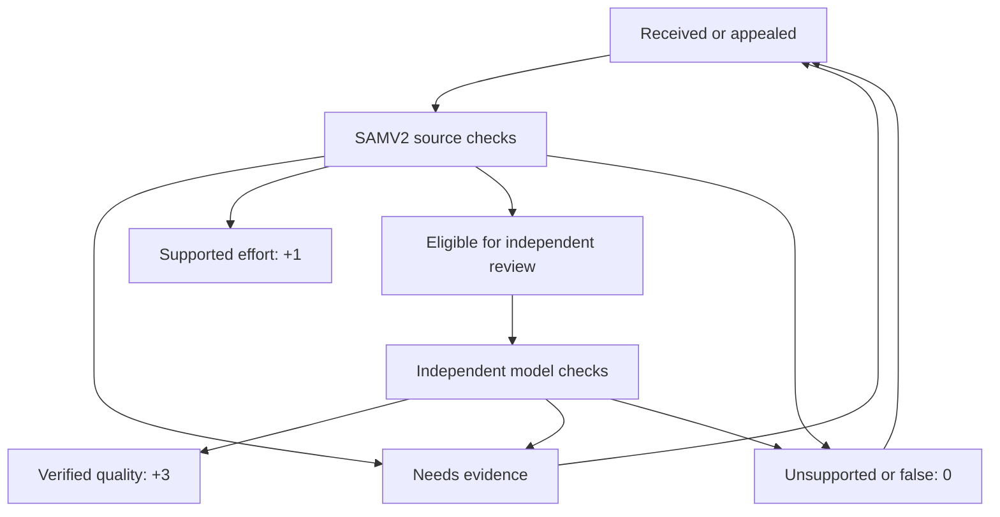

# Member research intake and award protocol

This module implements the durable inbox, attributable review receipts, leases, and point-award boundary. It does **not** implement financial research providers or claim that a model has verified anything before a real worker returns an authenticated receipt. The default unconfigured state accepts eligible member submissions and accurately reports them as pending.

## Ownership and integration

`server/member-research.ts` exports `mountMemberResearch(app, options)`, `initMemberResearch(db)`, `deleteMemberResearch(db, memberId)`, and `researchSignature(...)`.

Required options:

- `db`: the same SQLite database used for membership and the points ledger. Use a persistent volume; enable WAL, backups, and restore drills in deployment.
- `auth`: the member authentication middleware. It must set `c.get('member')` to an active, verified member with integer `id`, and perform the application's device, CSRF, and session checks.
- `canSubmitResearch(memberId)`: true only after the verified Discord quest is complete.
- `awardReview(input, authority)`: a synchronous adapter to `membership-quests.ts` `awardReview(db, input, authority, now)`. It must participate safely in a caller-owned transaction. Both modules use SQLite savepoints. A failed ledger write rolls back the receipt and terminal transition.

Worker configuration:

- `SAM_RESEARCH_SHARED_KEY`: at least 32 bytes, used only by the SAMV2 source-verification worker.
- `SAM_REVIEW_SHARED_KEY`: a different secret of at least 32 bytes, used only by the independent model-review worker.
- `allowedProviders`: explicit server-configured adapter identifiers permitted to attest source receipts. An empty list disables positive awards and false-information findings.
- `allowedReviewModels`: explicit pinned model/version identifiers permitted for independent review. An empty list disables +3 awards.
- `now`: optional injectable millisecond clock.

Do not give either worker secret to browsers, Discord commands, member accounts, or an LLM prompt. Role isolation is an authentication boundary. A signed receipt attests what a trusted worker did; the signature itself is not proof that its factual judgment is correct. Actual workers must retain provider artifacts, expose traceable run IDs, and be tested against known cases before being enabled.

## Member API

`POST /api/member/research` accepts:

```json
{
  "entity": "company or instrument identifier",
  "claim": "One precise, testable claim.",
  "eventAt": "2026-09-26T03:00:00Z",
  "sources": ["https://www.sec.gov/Archives/example-filing.html"],
  "reasoning": "Why the evidence supports this claim and why it matters.",
  "counterargument": "The strongest plausible contrary interpretation.",
  "invalidation": "What evidence would change this conclusion."
}
```

`eventAt` is optional and untrusted. It cannot independently qualify a member for a speed achievement. Use an `Idempotency-Key` header of 8–128 ASCII letters, digits, dots, colons, underscores, or hyphens. Identical content from the same member returns the existing submission. A key cannot later be reused with changed content, even if its first use deduplicated against a prior submission.

Successful response: `{submission:{id,entity,claim,status,points,reason,createdAt},duplicate}`. Pending `points` is `null`, not a zero-point judgment. The module allows up to 8 new submissions per rolling 24 hours and 10 pending submissions per member. These are protective defaults, not engagement targets. Input length is limited for reliability and never earns points.

`GET /api/member/research` returns the member's latest 100 summaries and explicit `readiness` booleans for intake, source verification, and independent review. A healthy queue does not imply that research providers are ready.

`GET /api/member/research/:id` returns that member's submission plus attributable supported, contradicted, unsupported, and unresolved claims, source links/clocks, evidence digest, and processor version. Other members receive 404. Internal worker credentials, raw authentication material, and other members' details are never included.

`POST /api/member/research/:id/appeal` accepts `{reason,sources:[httpsUrl]}` after `declined` or `needs_evidence`. Up to three appeals are retained as immutable events. The original submission remains unchanged. The next worker lease includes all appeal evidence and a new digest binding that exact context. Old receipts cannot approve the new context.

## Queue and points



Outages return work to a pending state with exponential retry delay. They never produce a false-information finding or award. Every stage records immutable events and versioned receipts. Five-minute leases prevent concurrent workers from processing the same current task. Expired leases can be reclaimed; a result for the replaced lease is rejected. Workers should finish within the lease or safely reclaim and recompute. Claims are bounded to 1–10 items.

Point policy:

- **0:** unsupported/irrelevant/duplicated contribution, or a critical claim contradicted by attributable evidence. The recorded reason distinguishes these outcomes. Missing provider access is not evidence that a claim is false.
- **+1:** meaningful original effort with a supported claim, correctly resolved entity and time, retained primary evidence, and no unresolved or contradicted critical claim. A noncritical interpretation can remain qualified in its explanation.
- **+3:** SAMV2 first marks the contribution eligible; a separate authorized model-review worker checks the identical immutable evidence and cutoff, and all critical checks pass.
- No reward for word count, speed, repeated posting, model agreement alone, or a numeric confidence statement. Exact duplicate content cannot receive repeated positive awards across members. The worker receives a duplicate count without member identities. Near-duplicates and coordinated abuse require substantive novelty checks and monitoring; the exact-match gate does not claim to solve those problems.

The quests ledger is the only points authority. A completed review and its ledger operation commit atomically. Receipt IDs are immutable and idempotent; changing a previously used ID's content is rejected. Appealed zero-point decisions supersede the prior review through the ledger's explicit replacement operation.

## Worker authentication

All internal endpoints are POST requests with JSON bodies, TLS, and these headers:

```text
x-sam-timestamp: current Unix time in milliseconds (13 digits)
x-sam-nonce: unique 16–100 character ASCII alphanumeric, underscore, or hyphen value
x-sam-signature: lowercase hexadecimal HMAC-SHA256
```

The HMAC message is the exact UTF-8 concatenation, without a trailing newline:

```text
timestamp + "\n" + nonce + "\n" + uppercaseHTTPMethod + "\n" + requestPath + "\n" + rawRequestBody
```

Sign the actual body bytes sent. Do not parse and reserialize after signing. Timestamps tolerate five minutes of clock skew. Nonces are retained durably for ten minutes and cannot be reused for the same role. A transport retry uses a **fresh nonce and the same receipt ID**. Internal requests are limited to 128 KiB before the handler reads the body; member and Discord payloads are limited to 24 KiB.

Endpoints and roles:

| Endpoint | Authorized role | Body |
| --- | --- | --- |
| `/api/internal/research/claim` | SAMV2 | `{ "limit": 5 }` |
| `/api/internal/research/sam-receipt` | SAMV2 | One source-verification receipt |
| `/api/internal/research/review-claim` | Independent review | `{ "limit": 5 }` |
| `/api/internal/research/model-receipt` | Independent review | One independent model receipt |

Each claim result contains `items` with `id`, `submission`, `appeals`, `inputDigest`, `asOf`, `submittedAt`, `exactDuplicateCount`, `earlierExactDuplicateCount`, `leaseToken`, and `leaseExpiresAt`. `asOf` is the immutable cutoff from the initial submission time, or the latest authoritative appeal submission time when appeal evidence is being reviewed. Every source receipt must echo it exactly; worker retries cannot move the cutoff forward. Independent-review tasks additionally contain the exact `samReceipt` and `evidenceDigest`. The earlier-duplicate count uses durable insertion order, so a later copier cannot disqualify the original submission. A batch model request may review several tasks, but it must return a separate attributable receipt and decision for every task; no blanket batch approval.

## Source-verification receipt

```json
{
  "receiptId": "samv2-run-unique-id",
  "submissionId": "submission-uuid",
  "leaseToken": "lease-uuid",
  "processorVersion": "samv2-research-2026-09-26",
  "inputDigest": "64-lowercase-hex-characters-from-claim-response",
  "asOf": "2026-09-26T03:00:00Z",
  "completedAt": "2026-09-26T03:01:00Z",
  "outcome": "eligible",
  "reason": "A specific explanation of what was established and what remains uncertain.",
  "checks": { "entityMatched": true, "timeAligned": true, "primarySourcesChecked": true },
  "originalContribution": true,
  "claims": [
    {
      "text": "The precise claim being assessed.",
      "verdict": "supported",
      "critical": true,
      "sourceRefs": ["retained-provider-receipt-id"],
      "explanation": "How the cited evidence supports the narrowly stated claim."
    }
  ],
  "sources": [
    {
      "url": "https://www.sec.gov/Archives/example-filing.html",
      "provider": "sec-edgar",
      "providerReceiptId": "retained-provider-receipt-id",
      "retrievedAt": "2026-09-26T03:00:30Z",
      "availableAt": "2026-09-26T02:59:00Z",
      "contentHash": "64-lowercase-hex-characters-of-retained-source",
      "primary": true,
      "entityId": "0000000001",
      "publisherId": "sec-cik:0000000001"
    }
  ]
}
```

The displayed hash strings above are explanatory placeholders, not valid receipt values. Receipts reject unknown fields. Allowed outcomes: `unavailable`, `needs_evidence`, `unsupported`, `false`, `supported_effort`, `eligible`. Claim verdicts: `supported`, `unsupported`, `unresolved`, `contradicted`.

Evidence source identifiers must point to immutable artifacts retained by the real provider adapter. `availableAt` is the information's original availability clock, not the time a delayed worker downloaded it. It cannot exceed `asOf`. Retrieval cannot occur after `completedAt`. A filing downloaded later may establish a claim that was already public at the cutoff; a new filing published after the cutoff cannot be silently used.

The worker must resolve `entityId` using issuer/instrument identifiers, not ambiguous company-name matching. `publisherId` identifies the actual independent primary publisher, not a distribution site. Syndicated copies share the publisher identity. Independent-primary-source achievements count these verified publisher IDs, not links or subdomains.

Optional `verifiedEventAt` and `primaryEventSourceRef` may be supplied only when the event clock is established by a cited retained primary source. The clock must be at or before `asOf`, and the time-alignment check must pass. These values are included in the evidence digest. Raw member-supplied `eventAt` never qualifies for a speed achievement.

The server calculates and returns `evidenceDigest`. It includes the input digest, cutoff, processor version, entity/time/source checks, claims, source receipts, originality result, and any source-verified event timestamp. Independent review must echo the server's digest exactly.

## Independent model receipt

```json
{
  "receiptId": "independent-review-unique-id",
  "submissionId": "submission-uuid",
  "leaseToken": "current-review-lease-uuid",
  "samReceiptId": "samv2-run-unique-id",
  "evidenceDigest": "digest-from-review-claim-response",
  "inputDigest": "digest-from-review-claim-response",
  "asOf": "2026-09-26T03:00:00Z",
  "modelVersion": "configured-pinned-model-version",
  "reviewerVersion": "research-review-worker-2026-09-26",
  "verdict": "approved",
  "reason": "Specific independent assessment of the claim and its limitations.",
  "checks": {
    "entityMatched": true,
    "timeAligned": true,
    "primarySourcesChecked": true,
    "evidenceSupportsConclusion": true,
    "independentReview": true
  }
}
```

Allowed verdicts: `approved`, `declined`, `needs_evidence`, `unavailable`. Every completed model decision requires an explicitly configured model version; an `unavailable` receipt can report a configuration outage without awarding points. A +3 decision additionally requires every check to pass. Independent review compares underlying source evidence, not merely the first model's summary. Evidence hash, input digest, SAM receipt ID, and cutoff must match the task exactly. Updating the cutoff or adding evidence requires a new source-verification task; a review worker cannot quietly approve a different investigation.

## Discord intake

Optional `discord` config contains the application's Ed25519 public key, a single guild ID, a single DD intake channel ID, and `getLinkedMember(discordUserId)`. The lookup must require `discord_member_links.state = 'verified'`, active verified membership, and a non-disabled member. Optional `getMemberSummary(memberId)` returns only `{userId,rank,title,points,deadline?,collectibles:[{collection?,title,serial,cap,choice?}]}`. Optional `publicOrigin` is the HTTPS site origin for published collectible artwork.

`POST /api/discord/interactions` validates Discord's Ed25519 signature over `timestamp + rawBody` and a five-minute timestamp window before inspecting any command. It answers Discord PING. The `/dd` command is accepted only in the configured guild and channel for a linked verified member with an unlocked research quest. Replies are ephemeral and do not publish private evidence into other channels. Repeated signed deliveries of the same interaction are idempotent.

Register a guild-only `/dd` command with required string options `entity`, `claim`, `sources` (space-separated HTTPS links), `reasoning`, `counterargument`, and `invalidation`; optional `event_at` is an ISO timestamp. Disable DMs and constrain command permissions. Command registration, bot installation, and channel creation are deployment work; this code does not perform them or announce that they are complete.

The same signed endpoint supports `/profile` and `/quest` (ephemeral summaries for the actual linked Discord identity), and `/badge` (earned collectibles only). Profile responses include the rank, title, research points, owned collectible serial/cap, and a Discord relative countdown only when a real deadline is configured. An unset deadline reads “No quest deadline has been announced.” These commands cannot look up membership ownership by a submitted UserID or email.

Register `/badge` with optional string `choice` constrained to `moon`, `stargazer`, `techhead`, `wolf`, and optional boolean `share`. Only artwork corresponding to the member's actual awards can display. Badge responses default to ephemeral; the member can explicitly set `share=true` to display their own collectible in the designated channel. Public responses contain UserID and collectible metadata, never email or research evidence. Artwork paths use fixed allowed enum names under `/badges/`; source URLs supplied by members cannot become embeds. All command responses disable mentions.

## Operational controls and remaining service work

- User URLs are hints. Intake accepts only public-looking HTTPS hostnames and never fetches them. A public-looking hostname can resolve privately; workers must resolve via approved providers or enforce DNS/IP/redirect allowlisting at every network hop. Do not hand these URLs to a generic unrestricted HTTP fetcher.
- All user text, linked documents, and Discord content are untrusted data. Keep provider credentials and system tools outside model context; source instructions cannot authorize actions.
- Retain submissions, receipts, audit events, and points decisions until an explicit authorized user deletion. Call `deleteMemberResearch` from that deletion transaction. Delete associated provider artifacts and external Discord/email personal data through the relevant retention process as appropriate. Nonces expire independently and contain no member content.
- Worker receipts are not generated by the website. Implement, test, deploy, and monitor SAMV2 provider retrieval and the independent model worker before configuring readiness.
- Configure worker scheduling, queue-depth alerts, lease failure/outage dashboards, adjudication review sampling, and provider artifact access controls. Stale pending work should remain visible rather than being relabeled as completed.
- Outcome emails are a separate durable outbox responsibility. Do not send inside the database transaction or synthesize an email-delivered status. Enqueue a deduplicated notification on the final review ID after/in the same commit using the application's outbox infrastructure.
- An authenticated worker can still be buggy or compromised. Provider allowlists, signed receipts, digest checks, and tests establish boundaries; periodic source audits and adjudication evaluation establish research quality.

## Verification

`tests/member-research.test.ts` exercises access and quest gating, URL rejection, per-member privacy, idempotency aliases, body and queue limits, HMAC and role separation, replay rejection, lease expiry, provider outages, false-claim attribution, one-time points, copied-content blocking, independent +3 evidence matching, cutoff leakage, atomic rollback, source-derived speed eligibility, appeal digest binding, explicit deletion, and authentic Discord intake confined to one channel.

## Member deletion propagation

The site creates a cleanup task only for a submission already leased to a worker, and removes the local research text immediately. These routes use the source worker’s existing HMAC authentication; the review credential is rejected. They expose no member identity or submitted text.

- `POST /api/internal/research/deletion-claim` accepts `{limit:1}` (maximum 10). Each item contains `submissionId`, a five-minute `leaseToken`, and `leaseExpiresAt`. An expired lease can be reclaimed.
- `POST /api/internal/research/deletion-receipt` accepts exactly `{submissionId,leaseToken,scope:"samv2-model-records-v1"}`. A receipt must match the current unexpired lease. Identical completed receipts can be retried with a fresh signed nonce.

The source process must commit central erasure before acknowledging. Its transaction removes both source/review model payloads and associated identifying metadata, retains anonymous cost accounting, and creates a content-free erasure tombstone. The same transaction lock at the central model-record boundary prevents a late response from saving erased data again. This scope does not attest to model-vendor, external trace or backup erasure. A failed cleanup never becomes a successful receipt.

Keep the source worker’s `--cleanup-only` mode operating if new model adjudication is paused. Alert on old pending cleanup jobs. A research receipt arriving after local deletion is rejected and cannot award points.
